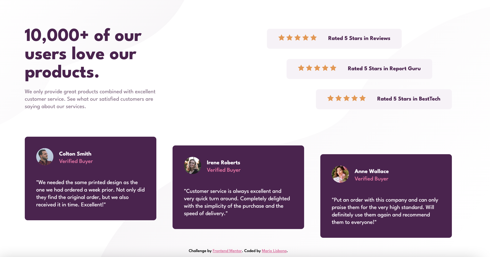
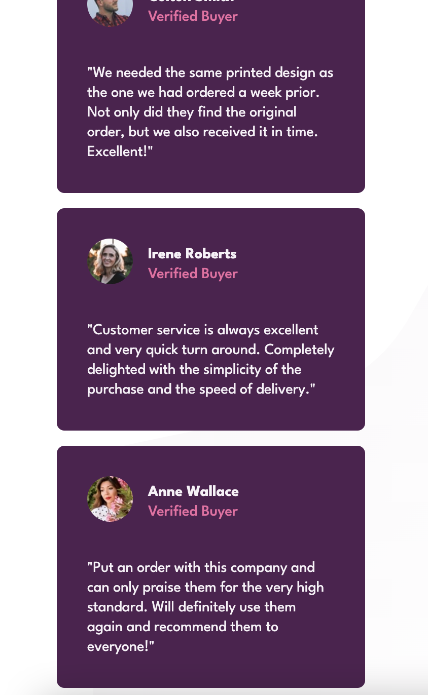

# Frontend Mentor - Social proof section solution

This is a solution to the [Social proof section challenge on Frontend Mentor](https://www.frontendmentor.io/challenges/social-proof-section-6e0qTv_bA). Frontend Mentor challenges help you improve your coding skills by building realistic projects. 

## Table of contents

- [Overview](#overview)
  - [The challenge](#the-challenge)
  - [Screenshot](#screenshot)
  - [Links](#links)
- [My process](#my-process)
  - [Built with](#built-with)
  - [What I learned](#what-i-learned)
  - [Useful resources](#useful-resources)
- [Author](#author)

**Note: Delete this note and update the table of contents based on what sections you keep.**

## Overview

### The challenge

Users should be able to:

- View the optimal layout for the section depending on their device's screen size

### Screenshot

### Links

- Solution URL: [Add solution URL here](https://github.com/MarioLisbona/FEM-social-proof-section)
- Live Site URL: [Add live site URL here](https://mariolisbona.github.io/FEM-social-proof-section/)

## My process
I worked from the outside in. I used a 2 x 2 grid as the main conatiner. I then used felxbox to style each grid item. I centered the star rating and testamonial cards then used `:first-child: flex-start` and `:last-child:flex-end` to arrange the div's in a staggered way.

### Built with

- Semantic HTML5 markup
- CSS custom properties
- Flexbox
- CSS Grid

### What I learned
I learned how to use two differnt background images and to position them to diffent locations. I used flex-box and grid to style the page and have gained more confindence in using it. I have started to be able to look at a design brief and see straight away how i can use flex-box and grid in combination to acheive the style.

### Useful resources

- [Multiple Background Images](https://www.w3schools.com/css/css3_backgrounds.asp#:~:text=CSS%20allows%20you%20to%20add,is%20closest%20to%20the%20viewer.) - I didnt know that using multiple background images was an option available. This site showed me how to use this feature.

- [Web Dev Simplified - CSS](https://courses.webdevsimplified.com/) - This was a great course that taught css in an easy to undertand way.

## Author

- Frontend Mentor - [@MarioLisbona](https://www.frontendmentor.io/profile/MarioLisbona)
